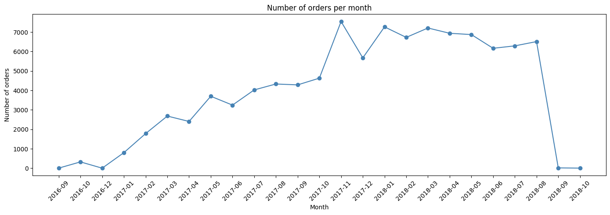
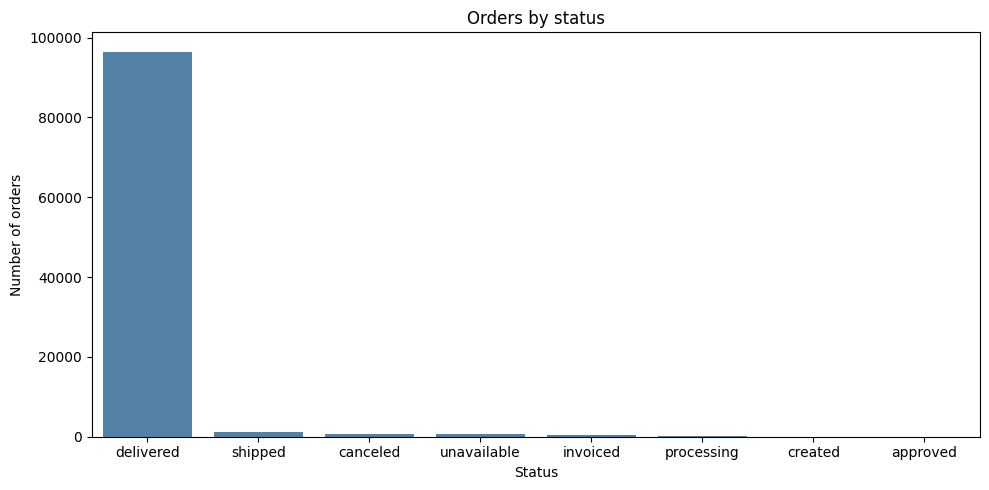
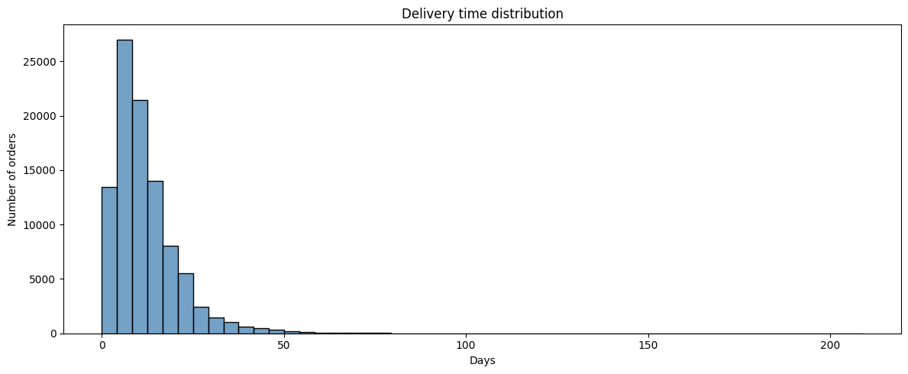
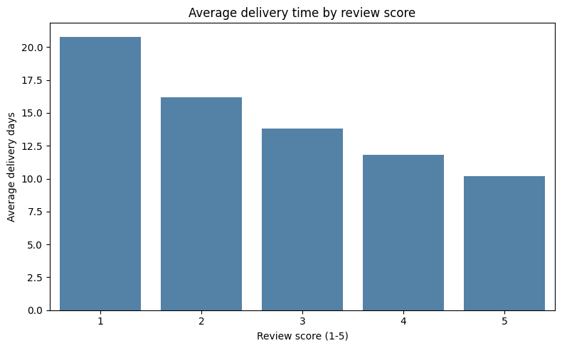

# ecommerce-analysis
Exploratory data analysis of 99k e-commerce orders using Python (pandas, seaborn, matplotlib). Identified correlation between delivery time and customer satisfaction.

November 2017 - huge spike, probably Black Friday
December 2017 - drop, which is typical after Black Friday
2018-09 and 2018-10 - almost zero, because the dataset stops (incomplete data)

96,478 (97%) orders have the status "delivered" - the store operates very efficiently
1,107 under delivery ("shipped")
625 canceled - that's only ~0.6%, a very low rate
The remaining statuses are marginal quantities

Average: 12.1 days - Typical delivery in Brazil takes almost 2 weeks
Median: 10 days - Half of orders arrive in 10 days or less
Max: 209 days - someone waited 7 months, this is clearly a problem/error in the data
The chart shows a right tail - most deliveries are fast, but there are extreme cases

Rating 1 → average 20.8 days delivery
Rating 5 → average 10.2 days delivery
The relationship is perfectly linear - the longer you wait, the worse your grades are
